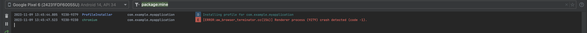

# Web View Renderer Crash

A minimal reproduction of a bug where we see WebView renderer process crashes reported in Logcat when calling destroy on a WebView.

Observed on: Google Pixel 6 and Samsung Galaxy S10 Lite (the only devices we have available for testing).

## App Setup

There's a single Activity `MainActivity` which has a layout containing a `FrameLayout` which acts as the parent/container for the WebView, 
a `WebView` and a `Button`.

In the Activity's `onCreate`, the button calls `container.removeAllViews()` and `webView.destroy()`.

## Logs after clicking the destroy button

